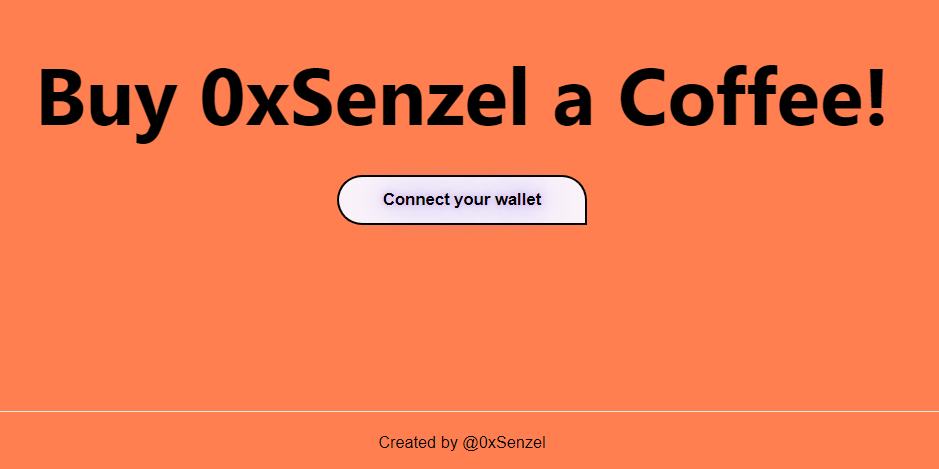

# Buy Me a Coffee DAPP

This repo contains coursework project from [Alchemy University](https://university.alchemy.com/) completed by [0xsenzel](https://github.com/0xSenzel/) for [Road To Web3](https://docs.alchemy.com/docs/welcome-to-the-road-to-web3) lesson.

## Project Info

Buy Me A Coffee is a popular website that creators, educators, entertainers, and all kinds of people use to create a landing page where anyone can send some amount of money as a thank you for their services. However, in order to use it, you must have a bank account and a credit card. Not everyone has that!

A benefit of decentralized applications built on top of a blockchain is that anyone from around the world can access the app using just an Ethereum wallet, which anyone can set up for free in under 1 minute.

## Project Demo

<figure>

<p align="center">Fig.1 - Home Page</p>
</figure>

<br/>

<figure>

<p align="center">Fig.2 - Connected with wallet</p>
</figure>

<br/>

<figure>

<p align="center">Fig.3 - Withdraw Form For Owner to Withdraw Eth</p>
</figure>

<br/>

## Project Setup

### Hardhat

Head to [hardhat-tutorial](./smart-contracts/) folder:

Install dependencies

```
npm install
```

Compile smart contract

```
npx hardhat compile
```

To deploy smart contracts: <br/>
Head to [hardhat.config.js](./hardhat-tutorial/hardhat.config.js) file, change the value of:

- `GOERLI_URL` with your own Ethereum Network API
- `PRIVATE_KEY` with your Ethereum wallet's private key
- `GOERLI_ETHERSCAN` with your Etherscan's API Key

Then run the following command.

```
npx hardhat run scripts/deploy.js --network goerli
npx hardhat verify --network mumbai YOUR_SMARTCONTRACT_ADDRESS "CONSTRUCTOR ARG1" "CONSTRUCTOR ARG2"
```

<br/>

### React & Next Js

At [root](./) folder

```
npm install
```

- Replace the variable inside [this file](./utils/BuyMeACoffee.json) with your contract's ABIs.

- Replace line 13 `contractAddress` variable inside [index.jsx](./pages/index.jsx) with your own deployed contract.

To run the app locally:

```
npm run dev
```
